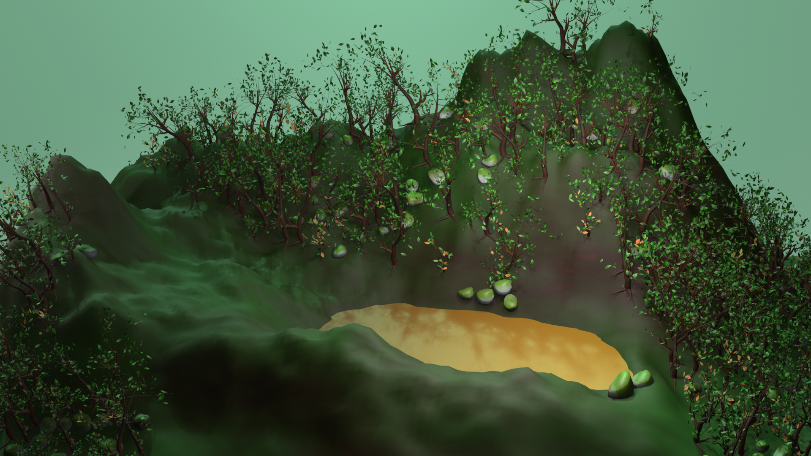

# ECHO Forest Scatter

**Procedural environment art and forest scattering system built with Blender Geometry Nodes.**

ECHO Forest Scatter is a Technical Art project focused on building an artist-directed, procedural workflow for creating stylized forest environments. The system grew from an earlier procedural tree generator, **TreeBase**, and extends that foundation from individual procedural vegetation assets to terrain-scale placement and art direction.

> **Status:** v0.1 — presentation and documentation in progress  
> **Blender:** 5.2.2 LTS  
> **Render:** EEVEE

## Project overview

The project is built around two connected procedural layers:

### TreeBase — procedural vegetation foundation

TreeBase was the starting point of the Blender project and the foundation that made ECHO Forest Scatter possible. Rather than beginning with a library of finished tree meshes, the work first focused on constructing reusable vegetation through Geometry Nodes.

The TreeBase system combines an artist-authored Bézier trunk with procedural generation for the remaining structure. Its modular pipeline includes:

- procedural branch hierarchies across multiple orders;
- fork generation;
- procedural root generation;
- procedural foliage distribution;
- controllable branch and foliage variation;
- reusable child-axis generation for hierarchical growth;
- instance-based foliage to preserve editability and reduce unnecessary geometry cost.

This stage established the procedural assets that could later be treated as a collection of forest-source variants.

### ECHO Forest Scatter — terrain-scale art direction

ECHO Forest Scatter expands the workflow from generating individual vegetation assets to composing a forest across a terrain. A Geometry Nodes modifier on the landscape exposes a compact set of artist-facing controls while keeping the resulting trees and forest assets instanced.

Current capabilities include:

- deterministic **Seed** variation;
- collection-driven forest asset selection;
- procedural density control;
- painted density through the `ECHO_Forest_Density` attribute;
- minimum point spacing;
- terrain-normal alignment;
- maximum-slope filtering;
- uniform random scale variation;
- random orientation;
- ground embedding;
- optional artist-defined boundary control;
- support for mixed source assets, including vegetation and rocks;
- preservation of instances rather than realizing the scattered assets.

The current presentation scene uses multiple procedural TreeBase-derived tree variants together with a rock source to demonstrate that the scatter layer is not hard-coded to one asset type.

## Design goals

The system is being developed around four principles: **artist control, modularity, determinism, and editability**.

The goal is not simply to generate a random forest. Artists should be able to direct where vegetation appears, constrain it according to terrain conditions, change the visual population through a source collection, and regenerate predictable variations through a seed without manually placing every asset.

The project also serves as a foundation for broader environment-production tooling within the ECHO toolset.

## Workflow

The current pipeline can be summarized as:

```text
Artist-authored trunk
        ↓
TreeBase Geometry Nodes
        ↓
Procedural branches / forks / roots / foliage
        ↓
Forest source variants
        ↓
ECHO Forest Scatter
        ↓
Density + terrain + slope + boundary art direction
        ↓
Instanced forest environment
```

## Technical notes

ECHO Forest Scatter is designed as an instancing workflow. Source assets remain editable and the scatter output avoids unnecessary realization of instances.

The current v0.1 focuses on reliable procedural generation and artist-facing placement controls. More advanced spatial-resolution and ecological systems are being explored separately and are intentionally outside the scope of this release.

## Repository contents

This repository documents the public-facing development of ECHO Forest Scatter and TreeBase. Technical breakdowns, node-graph captures, density-painting examples, boundary-control examples, and a short demonstration will be added as the presentation package is completed.

The complete editable Blender production file is **not distributed through this public repository**.

## Documentation

- [Technical overview](docs/technical-overview.md)
- [Demo notes](demo/README.md)

## Author

**Luis Ángel Motta Valero**

Procedural environment / Technical Art project developed in Blender.

## Rights

© 2026 Luis Ángel Motta Valero. All rights reserved.

Unless explicit permission is granted by the author, the source project, procedural systems, assets, images, and documentation in this repository are not licensed for redistribution, resale, or incorporation into other projects.
